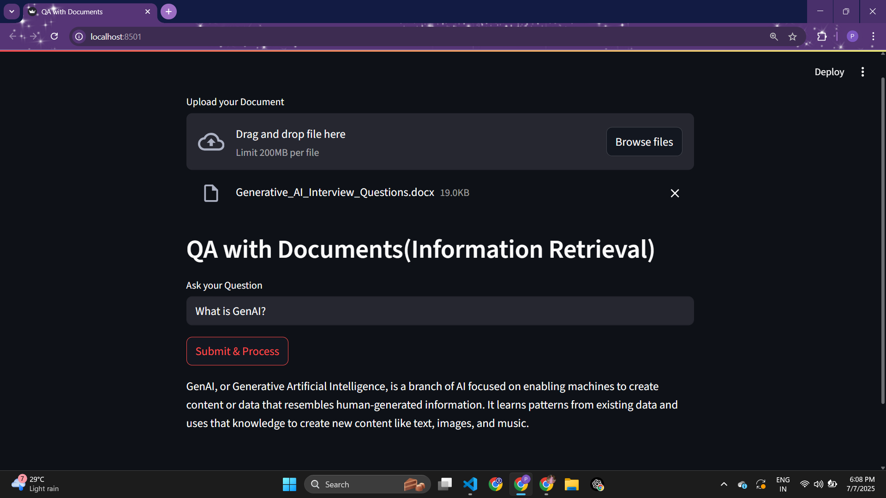

# 📚 QA with PDF using Gemini

This project is an interactive Question Answering (QA) system that uses Google Gemini (`gemini-pro` and `embedding-001`) to answer user queries from uploaded PDF documents. Built with **LlamaIndex**, **Streamlit**, and **Gemini API**, it allows users to upload a document and ask questions in real time.

---

## 🚀 Features

- ✅ Upload any PDF document
- ✅ Extract and embed content using LlamaIndex
- ✅ Use Gemini's `embedding-001` model for vector storage
- ✅ Query your document using Gemini's `gemini-pro` LLM
- ✅ Interactive Streamlit web UI

---

## 📁 Project Structure

```
QA-with-PDF-using-Gemini/
│
├── QAWithPDF/
│ ├── init.py
│ ├── data_ingestion.py # Load PDF documents
│ ├── embedding.py # Vector embedding using Gemini
│ ├── model_api.py # Load Gemini-Pro model
│
├── Experiments/
│ ├── experiments.ipynb
│
├── StreamlitAPP.py # Streamlit frontend
├── logger.py # Logging utility
├── exception.py # Custom exception handling
├── requirements.txt # Python dependencies
├── setup.py # For package setup (optional)
├── README.md # Project documentation
└── .gitignore

```
---

## 🛠️ Setup Instructions

### 1. Clone the Repo

```bash
git clon https://github.com/pooja30123/QA-with-PDF-using-Gemini.git
cd QA-with-PDF-using-Gemini
```

### 2. Create Virtual Environment

```bash
python -m venv venv
source venv/bin/activate  # Linux/Mac
venv\Scripts\activate     # Windows
```

### 3. Install Requirements

```bash
pip install -r requirements.txt
```

### 4. Set Environment Variable

```bash
GOOGLE_API_KEY=your_gemini_api_key_here
```
---

## 🧠 How It Works

```
1. Upload a PDF via the Streamlit UI.

2. The PDF is processed using SimpleDirectoryReader.

3. Text is embedded using GeminiEmbedding.

4. A vector index is built and queried using gemini-pro.

5. The result is shown on the UI.
```
---

## 🖥️ Run the App

```bash
streamlit run StreamlitAPP.py
```
---
## 📌 Dependencies

```
llama-index
streamlit
python-dotenv
google-generativeai
```
---

## 📸 Demo

Here's how the app looks when running:


---

## 📜 License

This project is open source under the MIT License.

---

## 👩‍💻 Author

```
Pooja Verma
MSc AI/ML @ IIIT Lucknow
Email: poojaverma300702@gmail.com
GitHub: pooja30123
```
---

## ⭐ Give it a star!

If you like this project, don't forget to ⭐ star the repo and share your feedback!

---